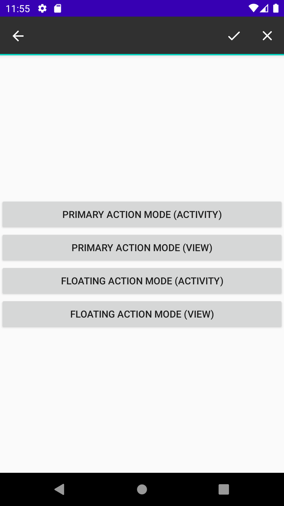
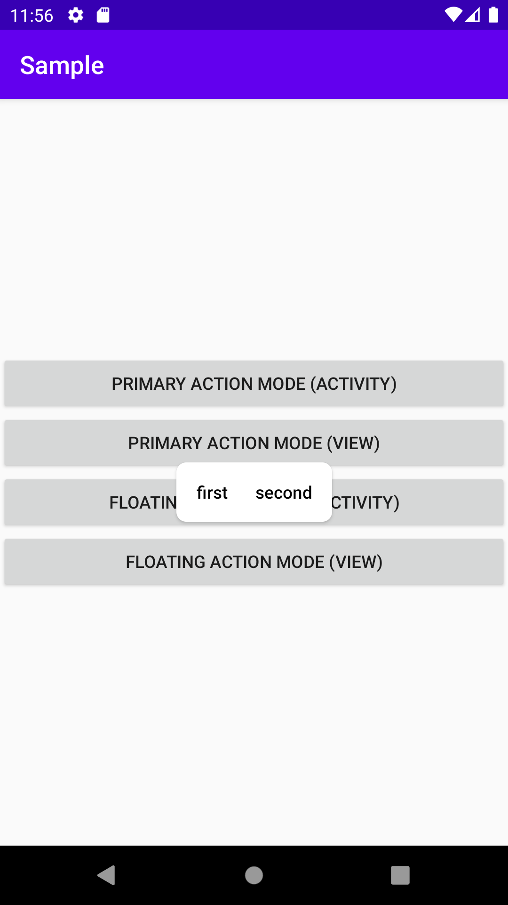

# 2020/09/02 ［Android］ActionMode を楽に実装する

# はじめに

Android には View などをクリックすると View の周りにメニューを表示したり、ActionBar 上にメニューを表示したりできる ActionMode という機能があります。View の周りにメニューを表示する方法を Floating Action と ActionBar 上にメニューを表示する方法を Primary Action と呼びます。今回は Floating Action と Primary Action の両方の ActionMode を使うための実装方法について説明します。

| Primary Action | Floating Action |
| ------- | ------- |
|  |  | 

# 実装

```kotlin
class ActionModeController(
    @MenuRes private val resId: Int,
    private val type: Int,
    private val onAction : (MenuItem) -> Unit
) {
    fun startActionMode(activity: Activity) {
        activity.startActionMode(createActionModeCallback(), type)
    }

    fun startActionMode(view: View) {
        view.startActionMode(createActionModeCallback(), type)
    }

    private fun createActionModeCallback(): ActionMode.Callback {
        return object: ActionMode.Callback {
            override fun onCreateActionMode(mode: ActionMode, menu: Menu): Boolean {
                Log.v("TAG", "onCreateActionMode")
                mode.menuInflater.inflate(resId, menu)
                return true
            }

            override fun onPrepareActionMode(mode: ActionMode, menu: Menu): Boolean {
                Log.v("TAG", "onPrepareActionMode")
                return false
            }

            override fun onDestroyActionMode(mode: ActionMode) {
                Log.v("TAG", "onDetroyActionMode")
            }

            override fun onActionItemClicked(mode: ActionMode, item: MenuItem): Boolean {
                Log.v("TAG", "onActionItemClicked")
                onAction.invoke(item)
                mode.finish()
                return true
            }
        }
    }
}
```

# 動作確認

```kotlin
class MainFragment : Fragment(R.layout.fragment_main) {
    override fun onViewCreated(view: View, savedInstanceState: Bundle?) {
        super.onViewCreated(view, savedInstanceState)

        val primaryActionModeController = ActionModeController(R.menu.action_menus, ActionMode.TYPE_PRIMARY) {
            when (it.itemId) {
                R.id.first -> {
                    Toast.makeText(context, "FIRST", Toast.LENGTH_SHORT).show()
                }
                R.id.second -> {
                    Toast.makeText(context, "SECOND", Toast.LENGTH_SHORT).show()
                }
            }
        }

        val floatingActionModeController = ActionModeController(R.menu.action_menus, ActionMode.TYPE_FLOATING) {
            when (it.itemId) {
                R.id.first -> {
                    Toast.makeText(context, "FIRST", Toast.LENGTH_SHORT).show()
                }
                R.id.second -> {
                    Toast.makeText(context, "SECOND", Toast.LENGTH_SHORT).show()
                }
            }
        }

        primary_action_mode_activity_button.setOnClickListener {
            primaryActionModeController.startActionMode(requireActivity())
        }

        primary_action_mode_view_button.setOnClickListener {
            primaryActionModeController.startActionMode(it)
        }

        floating_action_mode_activity_button.setOnClickListener {
            floatingActionModeController.startActionMode(requireActivity())
        }

        floating_action_mode_view_button.setOnClickListener {
            floatingActionModeController.startActionMode(it)
        }
    }
}

```

```xml
<?xml version="1.0" encoding="utf-8"?>
<LinearLayout xmlns:android="http://schemas.android.com/apk/res/android"
    xmlns:tools="http://schemas.android.com/tools"
    android:layout_width="match_parent"
    android:layout_height="wrap_content"
    android:layout_gravity="center"
    tools:context=".MainFragment"
    android:orientation="vertical">

        <Button
            android:id="@+id/primary_action_mode_activity_button"
            android:layout_width="match_parent"
            android:layout_height="wrap_content"
            android:text="PRIMARY ACTION MODE (ACTIVITY)"/>

        <Button
            android:id="@+id/primary_action_mode_view_button"
            android:layout_width="match_parent"
            android:layout_height="wrap_content"
            android:text="PRIMARY ACTION MODE (VIEW)"/>

        <Button
            android:id="@+id/floating_action_mode_activity_button"
            android:layout_width="match_parent"
            android:layout_height="wrap_content"
            android:text="FLOATING ACTION MODE (ACTIVITY)"/>

        <Button
            android:id="@+id/floating_action_mode_view_button"
            android:layout_width="match_parent"
            android:layout_height="wrap_content"
            android:text="FLOATING ACTION MODE (VIEW)"/>
</LinearLayout>
```

```xml
<?xml version="1.0" encoding="utf-8"?>
<menu xmlns:android="http://schemas.android.com/apk/res/android">
    <item
        android:id="@+id/first"
        android:title="@string/first"
        android:icon="@drawable/ic_done"
        />

    <item
        android:id="@+id/second"
        android:title="@string/second"
        android:icon="@drawable/ic_close"
        />
</menu>
```


# おわりに

ActionMode はなぜか実装例が検索しても出てきづらく難しいのかと思ったらそうでもないです。古くからあるからか Kotlin での実装例も少ないのでこの記事が役立てば幸いです。


# 参考文献

- [Using Android’s ActionMode](https://medium.com/over-engineering/using-androids-actionmode-e903181f2ee3)